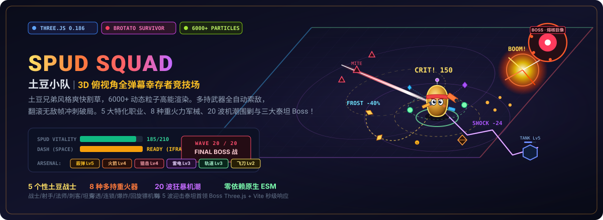

<p align="center">
  
</p>

<p align="center">
  <a href="https://holynova.github.io/spud-squad/"></a>
  <a href="https://threejs.org/"></a>
  <a href="https://vite.dev/"></a>
  
  
  <a href="https://github.com/holynova/spud-squad"></a>
</p>

---

## 🥔 游戏简介 (Overview)

**土豆小队 (Spud Squad)** 是一款受《土豆兄弟 (Brotato)》启发的 **3D 俯视角波次幸存者 Roguelite 游戏**。在充满未来赛博感的竞技场中，操纵全副武装的金属土豆战士迎战源源不断的机械异虫潮！

- 🚀 **6000+ 高性能粒子系统**：基于 Three.js 自研粒子池与着色器，支持弹道火光、击中火花、残影拖尾、受击爆裂与多层冲击波扩散。
- ⚔️ **全自动武器集群**：支持同时搭载多件各具弹道特性的重火力武器，走位避险的同时自动索敌歼灭敌人。
- 🛡️ **极限翻滚无敌帧**：空格冲刺提供 0.2 秒绝对无敌判定，在包围圈缩拢的关键时刻完成极限突围。
- 🔮 **纯原生技术栈**：Three.js + Vite，纯 ES Modules 构建，零重型 UI 框架开销，极速秒级冷启动。

---

## 🎮 在线试玩 (Play Online)

<p align="center">
  <a href="https://holynova.github.io/spud-squad/"><strong>👉 点击直接在浏览器畅玩：holynova.github.io/spud-squad 👈</strong></a>
</p>

<p align="center">
  <br>
  <em>手机浏览器或平板扫码亦可快速体验（推荐桌面端键盘操作）</em>
</p>

---

## 🕹️ 操作与热键 (Controls)

| 操作 | 按键 | 战斗技巧 |
|:---|:---|:---|
| **移动走位** | <kbd>W</kbd> <kbd>A</kbd> <kbd>S</kbd> <kbd>D</kbd> 或 方向键 | 保持圆周拉扯，将怪群聚拢在 AOE 武器射程内 |
| **战术冲刺** | <kbd>Space</kbd> (空格) | 拥有 0.2s 伤害免疫判定与移速爆发，冷却 1.5s |
| **武器射击** | 全自动索敌 | 自动计算距离与角度，锁定最近的高威胁目标 |
| **升级选卡** | 鼠标点击三选一 | 根据当前职业特性构筑互补词条 |

---

## 🥔 5 大特色土豆职业 (Characters)

| 职业 | 图标 | 初始武器 | 属性特征 | 专属主动技能 |
|:---|:---:|:---|:---|:---|
| **战士 (Warrior)** | ⚔️ | 霰弹枪 | 最大生命 +30, 移速 +5%, 伤害 +10% | **狂暴 (Berserk)**：3 秒内攻击速度剧增 +80% |
| **射手 (Ranger)** | 🏹 | 冲锋枪 | 移速 +10%, 攻速 +15%, 生命 -10 | **穿透射击 (Pierce)**：5 秒内所有子弹贯穿数量 +3 |
| **法师 (Mage)** | 🔮 | 特斯拉 | 技能范围 +20%, 伤害 +15%, 生命 -15 | **闪电风暴 (Storm)**：4 秒内连锁弹跳目标 +4 |
| **刺客 (Assassin)** | 🗡️ | 飞刀 | 移速 +15%, 暴击率 +15%, 暴伤 +50% | **影袭 (Shadow)**：2 秒内暴击几率暴涨 +40% |
| **坦克 (Tank)** | 🛡️ | 轨道炮 | 最大生命 +60, 基础减伤 +15%, 移速 -5% | **钢铁壁垒 (Bulwark)**：4 秒内获得 60% 巨额绝对减伤 |

---

## 🔫 8 种高能重型军械 (Weapons)

每种武器最高可升至 **Lv.5**，每次升级均会显著提升弹药密度、冷却缩减与特殊质变效果：

| 武器 | 属性 | 最高等级 | 弹道与作战特性 | 满级强化质变 |
|:---|:---:|:---:|:---|:---|
| **霰弹枪 (Shotgun)** | 动能 | Lv.5 | 扇面多发锥形散射，近距离弹丸独立计算暴击，强力后坐击退 | 10 发弹丸扇面爆发，伤害 +140% |
| **冲锋枪 (SMG)** | 动能 | Lv.5 | 极高射速连击，压制单体与走位清线 | 射速提升 30%，子弹自带贯穿 2 |
| **狙击枪 (Sniper)** | 动能 | Lv.5 | 超远射程电磁贯穿光矛，直线单发核弹级输出 | 伤害 150，直线穿透 8 个目标 |
| **火箭筒 (Rocket)** | 火焰 | Lv.5 | 抛射重型高爆导弹，命中产生巨幅烈焰爆炸与冲击波 | 爆炸半径扩张至 5.5 码，范围爆轰 |
| **特斯拉 (Tesla)** | 电弧 | Lv.5 | 自动锁定电浆弧光，命中后在周围敌人之间连续弹跳 | 弹跳跳跃至 8 个目标，连锁清场 |
| **冰冻射线 (Frost)** | 冰霜 | Lv.5 | 持续喷射锥形极寒冷冻束，附带 40%~55% 深度减速 | 扩大喷射扇面至 14 码射程，安全风筝 |
| **轨道炮 (Orbital)** | 动能 | Lv.5 | 实体能量弹体环绕土豆旋转，碰撞造成持续接触碾压 | 扩充至 5 枚高转速卫星，常驻护体 |
| **飞刀 (Knife)** | 动能 | Lv.5 | 回旋飞掷刀刃，飞出与返回路径均可造成双重伤害 | 每次连发 3 柄回旋飞刀，绞杀路径 |

---

## 👾 敌人兵潮与三大首领 (Enemies & Bosses)

游戏包含完整的 **20 个防御波次**，每 5 波迎来一次泰坦首领挑战：

```
Wave 1-4:  小兵 (Grunt) 与疾行怪 (Runner) 试水
Wave 5:    【首领】熔核巨像 (Colossus) —— 3000 HP 环形重炮火环与猛烈冲撞
Wave 6-8:  突刺者 (Dasher) 与分裂怪 (Splitter) 登场
Wave 10:   【首领】冰霜领主 (Frost Lord) —— 5000 HP 冰环召唤与极寒减速场
Wave 11-14: 精英怪群混编，移速与伤害持续升级
Wave 15:   【首领】虚空吞噬 (Void Devourer) —— 9000 HP 黑洞力场牵引与全屏弹幕
Wave 16-19: 终极疯狂红潮冲击
Wave 20:   【决战】虚空泰坦狂暴战，坚持到底斩获通关胜利！
```

- **小兵 (Grunt)**：集群基础冲锋单位。
- **疾行 (Runner)**：低血量高移速，短突刺冲刺。
- **重装 (Tank)**：高血量与护甲，掩护后排。
- **射手 (Shooter)**：保持 10 码安全距离远程吐射子弹。
- **突刺 (Dasher)**：蓄力红线警示后超高速线性突刺。
- **蜂群 (Swarmling)**：成群结队的微型敏捷单位。
- **分裂 (Splitter)**：击杀后当场裂解为 3 只蜂群。
- **精英 (Elite)**：携带强化护甲与多重数值倍率的巨型敌人。

---

## 📈 属性强化卡牌池 (Upgrades)

升级时从 12 种不同稀有度（普通 / 稀有 / 史诗）的强化卡片中随机抽选 3 张：

- **攻击力 (Damage)**：全局武器伤害 +15%
- **攻击速度 (Speed)**：全武器攻击频率 +12%
- **生命上限 (Max HP)**：最大生命 +25 并即时恢复 25 HP
- **移动速度 (Move Speed)**：基础移动速度 +10%
- **范围扩大 (Area)**：爆炸、技能与近战覆盖面 +20%
- **暴击率 (Crit Chance)**：暴击触发概率 +8%
- **暴击伤害 (Crit Damage)**：暴击倍率 +30%
- **护甲防护 (Armor)**：伤害固定减免 +8%
- **拾取范围 (Magnet)**：晶体拾取引力场半径 +30%
- **经验加成 (XP Boost)**：战斗经验获取量 +20%
- **金币加成 (Gold Boost)**：击杀金币产出量 +25%
- **生命恢复 (Regen)**：每秒常驻恢复 1.5 生命值

---

## 💻 本地运行与开发 (Development)

项目完全采用纯 ES Modules，无需复杂的构建预设：

```bash
# 1. 克隆代码仓库
git clone https://github.com/holynova/spud-squad.git
cd spud-squad

# 2. 安装开发依赖
npm install

# 3. 启动本地开发服务 (支持极速 HMR)
npm run dev

# 4. 生产环境打包
npm run build

# 5. 本地预览打包产物
npm run preview
```

构建产物将完整输出至 `dist/` 目录，可直接托管部署至 GitHub Pages、Cloudflare Pages 或任意静态托管服务。

---

## 📜 许可证 (License)

本项目采用 [MIT License](https://opensource.org/licenses/MIT) 协议开源。
